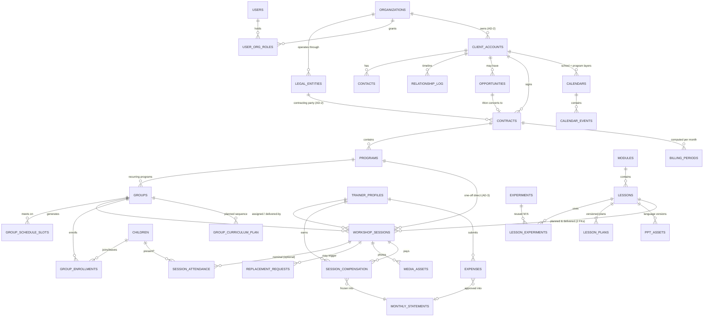

# WOW LAB OS — Solution Architecture Document (SAD)

| | |
|---|---|
| **Document** | Solution Architecture Document |
| **Product** | WOW LAB OS — franchise-ready STEM education operations platform |
| **Version** | 1.0 — for review & approval before development |
| **Date** | June 2026 |
| **Inputs** | WOW LAB OS PRD v1.0 (182 pp, source of truth) · V7 HTML prototype (UI/UX reference only) |
| **Audience** | Anca Tănăsescu (Platform Owner), implementation team, future technical leads |
| **Status** | DRAFT — pending stakeholder approval |

> **Reading guide.** Phases 1–2 establish what the business needs and how far the current prototype is from it. The *PRD Review* section records where this document deliberately deviates from or sharpens the PRD — every deviation is an explicit, reviewable decision (AD-x). Phases 3–5 define the target architecture. Phase 6 defines how to get there.

---

## Table of Contents

- **Phase 1 — Business Analysis**: processes, entities, roles, workflows, constraints, franchise requirements
- **Phase 2 — Gap Analysis**: V7 prototype vs PRD, area by area
- **PRD Review** — weaknesses, ambiguities, and Architectural Decisions (AD-1…AD-14)
- **Phase 3 — Solution Architecture**: system diagram, module architecture, navigation, screen map, user journeys
- **Phase 4 — Database Architecture**: entity list, ERD, table definitions, relationship rationale
- **Phase 5 — Permission Model**: 13-role matrix + row-level visibility rules
- **Phase 6 — Implementation Roadmap**: phases, dependencies, risks, complexity
- **Appendix A** — Glossary · **Appendix B** — PRD traceability matrix

---

# PHASE 1 — BUSINESS ANALYSIS

## 1.1 Business context

Wow Lab delivers STEM workshops to children through recurring school programs and one-off events (School Week, Green Week, birthday parties, corporate/CSR events, mall activations, open courses). Operations today run on ~8 unsynchronized Google Sheets, WhatsApp groups, personal Gmail accounts and team memory. The company operates through three legal entities (Experimente Wow SRL, Bradine ADV SRL, Asociația STEMplicity), with ~21 active freelance trainers (PFA/SRL — no employees), 14+ schools, and a small core team where several people each hold multiple roles.

The PRD's strategic intent goes well beyond digitizing today's spreadsheets: WOW LAB OS must become the **operational backbone of a future multi-organization, multi-country franchise network**, while explicitly *not* replacing accounting (SmartBill/SAGA), marketing CRM (ActiveCampaign), documents (Google Drive), email (Gmail) or messaging (WhatsApp).

Two PRD principles dominate every architectural choice:

1. **Workshop-centric**: the Workshop Session is the operational center; everything (trainers, attendance, content, photos, costs, compensation, billing) attaches to it.
2. **Institutional memory**: knowledge (school relationships, curriculum, evaluations, decisions) must belong to the organization, survive personnel changes, and become transferable to franchisees.

## 1.2 Core business processes

| # | Process | Summary | Today | PRD target |
|---|---------|---------|-------|-----------|
| P1 | Sales & opportunity management | Two motions: **Standard** (School Week / Green Week / birthdays — web forms via ActiveCampaign, fixed pricing, short cycle) and **Custom** (corporate/CSR/mall — discovery → proposal → negotiation, long cycle) | ActiveCampaign + email + memory | Operational pipeline in OS; AC stays marketing CRM; Won → Client/Contract without re-entry |
| P2 | Contracting & renewals | Contract types: School Year, Project, Trainer, Grant, Franchise. Billing models: per workshop / per enrolled child / per present child / fixed / custom. Annual renewal cycle per school | Drive + Sheets | Contract registry with statuses (Draft→Sent→Under Review→Signed→Expired→Archived), renewal workflow (Not Started→…→Signed) |
| P3 | Program & group setup | Won contract → Program → Groups (recurring) or direct sessions (one-off). Group: school, module, schedule, trainer, target size, attendance mode | Sheets + WhatsApp | Structured season planning; group statuses; Strategic Group override |
| P4 | Trainer recruitment & onboarding | Pipeline: New → CV → Phone Interview → PPT Assignment → Shadowing → Test Workshop → Accepted/Rejected/On Hold. PPT lateness = negative signal. Progressive access post-acceptance + Onboarding Academy | WhatsApp/email/Drive, untracked | ATS-lite with permanent interview notes, structured test evaluation, tracked onboarding checklist |
| P5 | Trainer allocation & replacement | Assign trainers to groups; handle absences via replacement requests; record original + replacement on every session; Replacement Rate KPI (>20% ⇒ warning + promotion block) | "Who can take Cambridge Tuesday 15:00?" on WhatsApp | Suggested-trainer ranking (availability, area, language, level, workload, school prefs); manual final decision; full allocation history |
| P6 | Curriculum development & validation | Module → Lesson → Experiment(s) → Lesson Plan → PPT. Plans must be personally tested by author before approval; trainer feedback loop (materials/timing/safety/equipment/pedagogy/supplier); every revision preserved | Google Docs comments, 20+ PPT variants per experiment | Versioned knowledge base; validation workflow; searchable experiment library (tags: Egg, Paper, Colors, Christmas…) powering proposals |
| P7 | Workshop scheduling | Sessions auto-generated from group schedule + School Calendar (official) + Optional Program Calendar + schedule exceptions (trips, sports day, exams…) | Manual calendars from school sites/PDFs | Deterministic, re-runnable generation; exceptions cancel/reschedule without touching the official calendar |
| P8 | Workshop delivery & reporting | Trainer confirms delivery, records children present, **delivered lesson** (vs planned), optional photos/notes — **in under 2 minutes, on a phone** | Sheets after the fact | One-tap mobile completion; Planned vs Delivered always distinguished, with adaptation reason |
| P9 | Attendance & enrollment | Numeric attendance mandatory; nominal optional (some schools never share names). Children join/leave mid-year with dated reasons; internal reasons trigger Operations follow-up; new child = Happy Face for trainer | Sheets | Dual attendance model per group; enrollment timeline with reasons; retention insights |
| P10 | Compensation, expenses & statements | Level-based hourly rates (L1 100 → L6 135 RON) × duration multiplier (1h=1.0, 1.5h=1.2, 2h=1.5) + language bonus (+20% FR/DE/ES/other) + travel bonus (+25% nearby / +100% intercity) + bonuses (Happy-Face linked) − penalties (3 Sad Faces same criterion = 100 RON, manager-approved). Expenses: submit → Finance review. Monthly Statement → trainer confirms → trainer invoices (PFA/SRL) → payment. Platform never issues legal invoices | 3 Sheets + Laura's manual reminders | Automatic computation from delivered sessions; immutable monthly statements; receipt uploads with audit trail |
| P11 | Client billing support & profitability | Billing computed per contract model; actual invoicing external (SmartBill). Profitability per school/group/program (revenue vs trainer+materials+travel+admin allocation); Strategic Groups may run at a loss intentionally | Manual | Billing periods with computed amounts; SAGA-compatible exports; profitability views with strategic override |
| P12 | Inventory & procurement | 3 categories: Consumables (fuzzy levels: Full/Half/Low/Empty — *never* "17 ml consumed"), Reusable Assets (individually tracked: holder, location, condition, transfer history — "who has Microscope #4?"), Kits. Material requests → procurement review → ordered → delivered. Trainer personal inventory supported | Color-coded Sheet (room/shelf/box) | Lightweight by design: "useful information, not warehouse precision" |
| P13 | Media capture & reuse | Photos uploaded from sessions (metadata auto-attached: school, group, module, lesson, trainer, date), delayed/batch uploads supported, AI + manual tagging, GDPR classification (Marketing / Internal / Restricted) with consent **source**, searchable library powering proposals & marketing | WhatsApp "MediaDump" | Every useful photo becomes a reusable, rights-tracked company asset |
| P14 | Community & engagement | ~10 mandatory monthly meetings/season (Sep–Jun); attendance tracked (3 missed/year ⇒ engagement warning visible in promotion review); internal newsletter archive; announcements; recognition (Trainer of the Month, Happy Faces); referral tracking | Password page on wowlab.ro + WhatsApp link | Community module owned by Community Manager role |
| P15 | Performance & promotion | Happy/Sad Faces per criterion; classroom evaluations (9 criteria) by Ops/Curriculum/Senior Trainers; promotion: 36 delivered workshops ⇒ *eligible* (external experience credit max 18), then **approval required**; blocked by replacement rate >20%, open complaints, missing documents | Sheets + memory | Transparent career engine with permanent history |
| P16 | Reporting & alerts | Role-specific dashboards (CEO, Operations, Finance, Curriculum, Community, Trainer, School, future Franchise); executive alerts (school health red, document expiry, unprofitable groups…); impact reporting for CSR/NGO/grants; "understand company health in <5 min/day" | None | Actionable dashboards, not BI sprawl |

## 1.3 Core business entities

**Tenancy spine** (strict ownership chain for operational data):
`Organization → (Legal Entity) → Client Account → Contract → Program → Group → Workshop Session`
*(see AD-2/AD-3 in PRD Review for two deliberate refinements to this chain)*

| Domain | Entities |
|---|---|
| Tenancy & identity | Organization (Main / Franchise / Partner), Legal Entity, User, Role Assignment |
| Clients & CRM | Client Account (School / Company / Parent / NGO / Public Institution / Partner), Contact (Academic / Operational / Commercial / Billing / Signatory), Relationship Log entry, School Health Score, Opportunity, Proposal, Renewal Cycle, School Request |
| Commercial | Contract (5 types, 5 billing models), Program (8 types), Billing Period |
| Educational delivery | Group, Group Schedule, School Calendar + Program Calendar, Schedule Exception, **Workshop Session** (center of the model), Attendance (numeric + nominal), Child, Enrollment, Replacement Request |
| People | Trainer Profile (lifecycle: Candidate → Recruitment → Onboarding → Active → Senior → Alumni), Recruitment Pipeline, PPT Assignment, Trainer Document, Availability Declaration, Trainer Level (1–6 + Lesson Plan Writer), Promotion Request, Experience Credit, Performance Indicator (Happy/Sad), Classroom Evaluation, Penalty |
| Knowledge | Module, Lesson, Experiment (M:N with lessons), Tag, Lesson Plan (versioned), Validation Record, Lesson Plan Feedback, PPT Asset, Group Curriculum Plan, Curriculum License, Content Change Request |
| Materials | Inventory Item (consumable), Asset (reusable), Asset Transfer, Kit, Storage Location, Material Request, Supplier, Purchase |
| Media | Media Asset (with GDPR status + source), Media Tag, Media Collection, Brand/Content Library asset |
| Money | Compensation Rule Set (versioned, currency-aware), Session Compensation, Bonus, Penalty, Expense, Monthly Trainer Statement, Admin Time Report (Toggl), Billing Period, Export Record |
| Community | Meeting, Meeting Attendance, Newsletter, Announcement, Recognition, Referral |
| Platform | Audit Log, Notification, Locale, Country Config, Franchise Agreement |

## 1.4 User roles

13 roles (PRD §6). **Permissions attach to roles, not people; one person may hold several roles; one role may be held by several people.**

| Role | Scope | Current holder(s) |
|---|---|---|
| Platform Owner | All organizations, all data, permissions, franchise settings | Anca Tănăsescu |
| Organization Owner | Everything inside one organization | (future franchise owners) |
| Sales Manager | Leads, opportunities, client relationships, proposals, forecast | Anca |
| Contract Administrator | Contract generation, tracking, signatures, archive | — |
| Operations Manager | Groups, scheduling, trainer allocation, replacements, school calendars | Cătălina |
| Curriculum Manager | Modules, lessons, lesson plans, experiments, validation | Cătălina |
| Finance Manager | Compensation, expense approvals, profitability, exports | Anca, Anka, Laura |
| Inventory Manager | Inventory records, stock, locations, audits | Teo, Cătălina |
| Procurement Manager | Purchasing, suppliers, purchase approvals | Anka, Cătălina |
| Community Manager | Meetings, newsletter, engagement, recognition | Alexandra ("Happiness Guru") |
| Senior Trainer | Evaluates juniors, supervises shadowing, assessments (L5–L6) | — |
| Trainer | Own workshops, curriculum access, attendance, expenses, own evaluations | 21+ trainers |
| Candidate | Recruitment-stage only: onboarding tasks, PPT assignment, status | — |

The fact that **Cătălina currently holds four roles** (Operations, Curriculum, Inventory, Procurement) and **Anca three** (Platform Owner, Sales, Finance) is itself a requirement: the UI must compose capabilities across roles for one logged-in person, and must keep working when those roles are later split across different people (PRD §10.2).

## 1.5 Major workflows (canonical chains)

1. **Custom sale → delivery**: Opportunity (Lead→Qualified→Discovery→Proposal Sent→Negotiation→Won) → Contract (Draft→Signed) → Program → Groups/Sessions → Operations — *no data re-entry at any hop*.
2. **Season setup (recurring school)**: Renewal cycle → signed School-Year Contract → Program → Groups (module, schedule, trainer, target size) → calendar-driven **session auto-generation**.
3. **Daily delivery (trainer, mobile)**: Today's session → prep checklist → deliver → confirm delivery + children present + delivered lesson (+ adaptation reason if ≠ planned) + photos → done in ≤2 min.
4. **Replacement**: Trainer submits request (date, reason) → Operations notified → replacement selected (suggested ranking) → approved → session records both trainers → Replacement Rate updates.
5. **Recruitment**: Candidate created (source) → pipeline statuses → PPT assignment (deadline / days-late tracked) → shadowing → test workshop (structured evaluation) → Accepted ⇒ user account + progressive access + onboarding checklist.
6. **Lesson plan lifecycle**: Draft (author) → personal experiment test recorded → validation checks → Approved/published → trainer feedback entries → revision (all versions preserved).
7. **Monthly money close (trainer)**: delivered sessions → auto compensation (rate × multiplier + bonuses − penalties) + approved expenses → **Monthly Statement issued (frozen)** → trainer confirms → trainer sends own invoice → Finance verifies → paid.
8. **Monthly money close (client)**: contract billing model + operational data → Billing Period computed → exported / handed to SmartBill → invoice status tracked (sent/paid).
9. **Admin collaborator pay**: Toggl PDF upload → Anca approval → invoice → payment (API integration later).
10. **Promotion**: delivered count + credits ≥ threshold ⇒ *Eligible* → quality gates checked (replacement rate, complaints, documents) → manager approval → level history updated → new rate applies from effective date.
11. **Media reuse**: session photos uploaded (metadata auto-attached) → AI + manual tags → GDPR classification with source → searchable library → proposal/marketing collections.
12. **Franchise curriculum governance (future)**: franchise submits improvement → curriculum review → approved → global knowledge base updated; licenses control which orgs see which content.

## 1.6 Operational constraints

- **Mobile-first**: ≥90% of trainer tasks executable on a phone; post-workshop reporting ≤2 minutes (PRD §3.1, §3.7, §10.13).
- **Enter once**: data reuse everywhere (PRD §3.3); auto-prepopulation of media metadata (§13.6).
- **AI assists, humans approve** — every AI feature (trainer suggestions, lesson drafts, tagging) ends in human decision (§3.4).
- **Planned ≠ Delivered must always be recorded** — non-negotiable, appears three times in the PRD (§7.11, §9.20, §10.14).
- **Numeric attendance mandatory; nominal optional per school** (§7.12).
- **No employees**: all trainers and admin collaborators are PFA/SRL; **the platform must never generate legal invoices** (§11.16); accounting stays in SmartBill/SAGA (§18.8–18.9).
- **Configurable business values**: rates, multipliers, bonuses, penalty amounts, thresholds (20% replacement, 3 sad faces, 3 missed meetings, low-stock levels) must be data, not code (§11.4, §11.8, §12.17).
- **Strategic overrides**: groups (§7.9, §11.22) and schools (§14.12) may be intentionally unprofitable.
- **Seasonality**: school year Sep–Jun; ~10 meetings/season; availability collected annually (§8.12, §16.3).
- **Permanence**: interview notes, evaluations, relationship logs, lesson plan revisions, asset history — *nothing is lost* (§8.22, §9.15, §12.7, §14.7).
- **Lightweight inventory** — fuzzy consumable levels; trainers are educators, not warehouse staff (§12.2, §12.4).
- **Integration boundaries fixed** (§18.2): ActiveCampaign = marketing CRM; Drive = document repository (OS stores metadata + links); Gmail = official comms; WhatsApp = rapid comms (OS = knowledge layer); SmartBill/SAGA = invoicing/accounting; Google Calendar = scheduling (optional sync later).
- **NFRs** (§20): cloud, multi-tenant, API-first, English-first UI; page <2s, dashboards <5s; RBAC + audit on contracts/trainer/compensation/curriculum/permission changes; scale to 100+ schools, 1,000+ groups, 10,000+ sessions without redesign.

## 1.7 Future franchise requirements

- **Network tree**: Wow Lab Global → country → city organizations (§19.3); each franchise independently manages schools, trainers, contracts, inventory, revenue (§19.4).
- **Global visibility**: Platform Owner sees all orgs/KPIs; franchisees see only their own (§19.5).
- **Shared knowledge base with governance**: global modules/lessons/experiments/plans/PPTs; local improvements flow back through review (§19.6–19.7).
- **Localization**: English-first internally; RO/FR/ES/DE + configurable languages (§19.8); currencies, date formats, tax rules, legal entities per country *without custom development* (§19.9).
- **White label** is Phase 3+ — keep theming hooks, build nothing now (§19.10).
- **AI layer (V12+)**: lesson-plan writer, curriculum builder, proposal builder, media assistant, reporting assistant — all human-approved (§19.11–19.15).
- **Franchise dashboard** KPIs: revenue, schools, groups, workshops, trainers, renewal rate, profitability, growth (§19.20).
- **Implication for today**: multi-org tenancy, currency/locale fields, content ownership/visibility and the licensing model must exist in the data layer **from day one**, even while the UI serves a single organization (§3.5: "without requiring architectural redesign").

---

# PHASE 2 — GAP ANALYSIS (V7 prototype vs PRD)

## 2.1 Method

The V7 prototype (`wow_lab_portal_v7.html`) was inspected structurally: 4 hard-coded personas (`trainer`, `coord`, `finance`, `master`), one fully built screen per persona ("Today" / "Payroll Board" / "Operational Health"), sidebar navigation labels (mostly non-functional placeholders), and 8 modal mock-ups (workshop session, attendance, materials, media upload with GDPR tag, replacement, school, costs, profile). It contains **no data layer, no auth, no routing, no state** — it is a visual design artifact, and per the brief it is treated strictly as a UI/UX reference.

## 2.2 What V7 genuinely contributes

- A validated **brand design language** (Tilt Neon + Cabin, magenta/orange gradient system, dark sidebar, pill components, stat cards) that all future screens should inherit.
- A strong **trainer mobile UX pattern**: Today view with session cards + 7-step prep/reporting bar (Plan ✓ PPT ✓ Materials ✓ Tested ✓ Attendance ○ Log ○ Hours ○) — directly reusable for PRD §10.13's 2-minute reporting goal.
- A correct **dashboard tone** (actionable alerts, badges, readiness boards) matching PRD §17.2's philosophy.
- Useful seed interactions: per-child attendance toggle, media upload modal with GDPR dropdown, "Find replacement" alert button, payroll readiness matrix.

## 2.3 Gap table

Legend — **Exists in V7**: ✔ built · ◐ visual mock / nav label only · ✖ absent.

| # | Area | Exists in V7 | Missing (vs PRD) | Recommendation |
|---|------|--------------|------------------|----------------|
| 1 | Multi-organization tenancy (§5, §19) | ✖ | Organizations, org types, network tree, org-scoped data, Platform-Owner cross-org view | Build into the data layer in Phase 0; single-org UI until Franchise phase (AD-1) |
| 2 | Legal entities (§5.4–5.5) | ✖ | Entity registry; entity on contracts; consolidated vs per-entity reporting | Phase 0 schema + Contracts module (AD-2) |
| 3 | Authentication & roles (§6) | ◐ role-switcher between 4 fake personas | Real auth (invited-only, Google login), 13 roles, multi-role composition, permission engine, RLS | Phase 0; V7's 4 personas become role-driven dashboard compositions |
| 4 | Client accounts & contacts (§7.4–7.5, §14.2–14.5) | ◐ school names appear inside cards | Client types (6), permanent accounts across years, contact registry with types + intelligence notes | CRM-thin module, Phase 1 |
| 5 | Relationship log & school health (§7.6, §14.6–14.11) | ✖ | Timeline entries (8 types), permanent history, health score G/Y/R, strategic flag | One of the highest-value features; Phase 1 |
| 6 | Opportunities & sales pipeline (§15) | ✖ | Opportunity statuses (8), two sales motions, owners, lost reasons, proposal records, Won→Contract handoff | Thin operational pipeline (AD-11), Phase 4 |
| 7 | Contracts (§7.7) | ◐ "Contracts" nav label (finance) | 5 types, 6 statuses, 5 billing models, files, renewal linkage | Phase 1 (light: registry + billing model) → Phase 4 (full lifecycle + renewals) |
| 8 | Programs (§7.8) | ✖ | 8 program types; container between contract and groups/sessions; one-off event support | Phase 1 — required so birthday/corporate sessions exist without fake "groups" (AD-3) |
| 9 | Groups & schedules (§7.9, §10.3–10.4) | ◐ static group cards | CRUD, 6 statuses, schedule slots, target size, attendance mode, Strategic Group override | Phase 1 |
| 10 | School & program calendars + exceptions (§7.14, §10.9–10.11) | ✖ | Two calendar layers, exception types, impact on generation | Phase 1 — prerequisite for session generation |
| 11 | Session auto-generation (§10.8) | ✖ | Deterministic generation from schedule × calendars × exceptions; safe regeneration | Phase 1 (AD-9) |
| 12 | Workshop session lifecycle (§7.10–7.11, §10.12–10.14) | ◐ Today cards + prep bar (excellent UX seed) | Statuses, reschedule chains, **planned vs delivered lesson + adaptation reason**, reporting-complete logic | Phase 1 core (AD-4) |
| 13 | Attendance (§7.12, §10.15) | ◐ per-child toggle modal | Numeric mode (mandatory), per-group mode switch, schools-without-names support | Phase 1 — V7 modal covers only the nominal case |
| 14 | Children & enrollment (§10.16–10.18) | ◐ names hard-coded in modal | Child records (PII-minimal), enrollment start/end + reasons, internal-reason follow-ups, Happy Face on new child | Phase 1; GDPR care (AD-6 analog for children data) |
| 15 | Replacement workflow (§7.13, §10.19–10.20) | ◐ alert + "Find replacement" button | Request entity, approval, both trainers on session, Replacement Rate KPI + 20% gate | Phase 1 |
| 16 | Trainer recruitment pipeline (§8.2–8.8) | ✖ | 12 pipeline statuses, sources, CV/notes, PPT assignment with days-late, shadowing, test evaluation | Phase 2 (ATS-lite); candidates without auth accounts (AD-6) |
| 17 | Onboarding academy (§8.9) | ◐ "Initial Test" nav label | Content items (video/PDF/article/checklist), per-trainer progress, progressive access | Phase 2 |
| 18 | Trainer profile, documents, availability (§8.10–8.12) | ◐ "Availability" label | Permanent profile, document registry with expiry + renewal reminders, annual availability declarations | Phase 2 |
| 19 | Levels, promotion, performance (§8.13–8.19) | ◐ "Performance"/"Reliability" labels | Configurable level table, 36-workshop eligibility + 18-credit cap, approval gates, Happy/Sad Faces, penalties (3× rule), 9-criteria classroom evaluations | Phase 2 engine + Phase 4 money linkage (AD-5) |
| 20 | Monthly meetings & engagement KPI (§8.20, §16.3–16.8) | ✖ | Meeting registry, attendance, 3-missed warning feeding promotion review | Phase 2 (small) |
| 21 | Curriculum hierarchy & experiment library (§9.2–9.9) | ◐ "Lesson Plans"/"Curriculum" lists (static) | Modules/lessons/experiments with M:N, metadata, tag-driven search powering proposals | Phase 3 |
| 22 | Lesson plan lifecycle (§9.10–9.15) | ✖ | Versioning, personal-testing validation, feedback categories, full revision history | Phase 3 |
| 23 | PPT library (§9.16–9.17) | ◐ "PPT Library" label | Language/corporate versions, Drive references, ownership migration tracking | Phase 3 (metadata + links; files stay in Drive, AD-7) |
| 24 | Inventory, assets, procurement (§12) | ◐ "Materials" label + request modal | Consumables (fuzzy levels), individually tracked assets + transfer history, kits, storage locations, request→procure flow, low-stock alerts, trainer personal inventory | Phase 3 (lightweight by design) |
| 25 | Media library & GDPR (§13) | ◐ upload modal with GDPR dropdown (good seed) | Auto-metadata, batch/delayed uploads, tagging (AI later), GDPR **source**, search, favorites, collections, brand library | Phase 3 |
| 26 | Compensation engine (§11.3–11.10) | ◐ trainer "Payments" page (static numbers) | Rule sets (rates, multipliers, language/travel bonuses) as versioned data; per-session computation; bonus/penalty integration | Phase 4 (AD-5) |
| 27 | Expenses & monthly statements (§11.11–11.16) | ◐ payroll readiness board (static) | Expense submit/approve with receipts, material-cost monitoring, **frozen** monthly statements, trainer confirmation, invoice/payment tracking | Phase 4 (AD-10) |
| 28 | Admin time / Toggl (§11.17–11.18) | ✖ | PDF upload → approval → invoice → payment trail | Phase 4 (manual-first) |
| 29 | Client billing & profitability (§11.19–11.23) | ◐ "School Invoices"/"SAGA Export"/"Cost Overview" labels | Billing periods per contract model, export contract, profitability per school/group/program with strategic overrides | Phase 4–5 |
| 30 | Community: newsletter, announcements, recognition, referrals (§16.9–16.17) | ◐ "Newsletter" label | Archive, categories, announcements, recognition visible on profiles, referral credit | Phase 2 (meetings) + Phase 5 (rest) |
| 31 | Dashboards & alerts (§17) | ◐ 4 static dashboards (right tone) | KPI engine, 8 role dashboards, executive alerts, historical trends, impact reporting | Incremental per phase + consolidation in Phase 5 |
| 32 | Integrations (§18) | ✖ | Drive metadata refs, AC Won-handoff, SmartBill/SAGA export, Google login, notifications, Calendar/Toggl APIs (later) | Phase 0 (auth) + Phase 5 |
| 33 | Multi-language / multi-currency (§19.8–19.9) | ✖ | UI i18n, content language variants, currency on all money | Schema from Phase 0 (AD-5, AD-12); UI activation in Phase 6 |
| 34 | Audit log & notifications (§20.3, §20.5, §18.13) | ✖ | Row history on sensitive tables, action log, in-app/email notifications | Phase 0 foundation (AD-13) |

## 2.4 Conclusion

V7 covers, optimistically, **~10–15% of the PRD's screen surface and 0% of its data/permission layer**. Its real value is the design system and the trainer-day UX pattern. The correct strategy is **not** to extend V7 incrementally, but to architect the full platform (Phases 3–5 below) and re-implement V7's visual language inside it. The four hard-coded personas must be replaced by **capability-composed navigation** — otherwise the 13-role model and multi-role users (Cătălina ×4) cannot work.

---

# PRD REVIEW — Weaknesses, Ambiguities & Architectural Decisions

The PRD is unusually thorough on *business* behavior. The issues below are places where it is ambiguous, internally tense, or silent on something architecture cannot leave open. Each is resolved by an explicit decision (**AD-x**) that the rest of this document assumes. **Approving this SAD = approving these decisions.**

| AD | Issue in PRD | Risk if ignored | Decision / Alternative |
|----|--------------|-----------------|------------------------|
| **AD-1** | Multi-tenancy demanded (§5, §19) but no isolation model specified | Choosing per-tenant databases later = rewrite | **Single shared PostgreSQL schema, `organization_id` on every org-scoped row, enforced by Row-Level Security**; platform-scope rows (global curriculum, locales) carry owner + visibility. Cheapest to operate, proven at this scale (§20.4), supports consolidated reporting natively. Revisit only if a franchisee legally requires physical isolation. |
| **AD-2** | §7.2 shows a strict cascade `Organization → Legal Entity → Client Account` — clients nested under a legal entity | A school billed via SRL one year and Asociația the next would split its history, killing §14.2 ("single School Account across years") | **Client Accounts belong to the Organization. The Legal Entity is referenced on each Contract** (the contracting party), not above the client. The §7.2 diagram is treated as conceptual, not relational. |
| **AD-3** | Chain implies every session sits under a Group, but §7.8 says one-off programs (birthday, corporate) may contain sessions directly | Fake one-session "groups" pollute group KPIs, retention stats, strategic flags | **`workshop_sessions.program_id` mandatory; `group_id` optional.** Recurring programs use groups; one-off events attach sessions to the program directly. |
| **AD-4** | Session statuses list both **Delivered** and **Completed** (§7.10) with no definition of the difference | Two manually-set near-synonyms ⇒ inconsistent data, broken payroll filters | **Lifecycle status = Scheduled / Delivered / Cancelled / Rescheduled** (mutually exclusive facts about the event). **"Completed" is derived**: Delivered ∧ attendance recorded ∧ delivered-lesson recorded (∧ hours where applicable) = `reporting_complete`. Dashboards may display it; nobody sets it by hand. |
| **AD-5** | Compensation values are written as constants (100–135 RON, +20%, +25%/+100%, 100 RON penalty) while §11.4/§11.8 demand changeability and §19.9 demands multi-currency | Hard-coded money = re-deploys for every rate change; RON-only = franchise blocker | **All compensation parameters are data**: versioned, org-scoped Rule Sets (level rates, duration multipliers, language bonuses, travel zones, penalty amounts) with effective-from/to dates. **Every monetary column carries a currency.** Today's numbers become the seed Rule Set for Wow Lab Bucharest. |
| **AD-6** | Candidates are platform users (§6.13) | Auth accounts + GDPR obligations for people who may be rejected in week 1; inflated user admin | **Candidates exist as records, not accounts.** PPT submission and status checks happen through expiring magic-links. A real account (with progressive access, §8.8) is created only on Acceptance. |
| **AD-7** | §18.4 keeps Drive as document repository, but receipts, workshop photos and trainer documents need RLS, GDPR classification and EU residency that Drive links can't enforce | Either everything leaks into Drive (no access control) or everything moves to the platform (violates §18.4) | **Storage split**: *operational binaries* (receipts, workshop photos, trainer documents, signed-contract copies) → platform object storage (EU) under the permission model; *authored documents* (lesson plans, PPTs, proposals, school calendars, marketing masters) → remain in Drive, referenced by metadata + link (§18.4 verbatim). |
| **AD-8** | Franchisees must see global curriculum and contribute back (§19.6–19.7), but the ownership/visibility mechanics are unspecified | Naive global tables ⇒ franchisees can edit the master; naive copies ⇒ divergence | **Content carries `owner_organization_id` + `visibility` (private / network). A Curriculum License table grants read access per franchise.** Edits by non-owners are impossible; improvements travel as **Content Change Requests** (submitted → reviewed → approved → applied by owner) — exactly §19.7. |
| **AD-9** | Sessions are auto-generated (§10.8) and calendars/exceptions change mid-year, but regeneration rules are unspecified | Re-running generation could duplicate or delete sessions that already have attendance/photos/compensation | **Generation is deterministic and idempotent** (group + date unique). On calendar/exception change: future `Scheduled` sessions are adjusted; `Delivered/Cancelled` (and anything with reporting or compensation) is immutable; conflicts surface as Operations alerts, never silent deletes. |
| **AD-10** | Monthly statements are reviewed then invoiced (§11.15–11.16), but mutability is unspecified | A rate fix in February silently changing January's confirmed statement destroys trust and audit | **Statements and Billing Periods are frozen snapshots once issued.** Later corrections are explicit adjustment lines on the *next* period, with reason and approver. Rule-set changes apply from effective dates, never retroactively by default. |
| **AD-11** | §4 says the platform does not replace CRM, §15 then specifies CRM features | Scope creep into a second ActiveCampaign | **Thin operational CRM boundary, enforced**: opportunities, statuses, owners, notes, proposal *records*, lost reasons — yes. Email sync, marketing automation, campaign analytics — never. AC integration starts as a manual/CSV "Won → create Client" handoff; webhook automation later (§18.3). |
| **AD-12** | "Multi-language" covers two different problems: UI language and curriculum language versions (§9.16 PPTs per language, §19.8) | Conflating them ⇒ either translated UIs masquerading as content or content rows abused as translations | **Split i18n**: (a) UI string catalogs per locale, English-first; (b) content entities (modules, lesson plans, PPTs) carry a `language` and a `family_id` linking variants of the same pedagogical unit. |
| **AD-13** | §20.5 lists what must be audited but not how | Ad-hoc logging misses exactly the change that matters in a dispute | **Two audit layers**: (a) database-level row history (old/new values, actor, timestamp) on sensitive tables — contracts, compensation, levels, permissions, curriculum approvals, statements; (b) application action log for business events. Append-only, Platform-Owner-readable. |
| **AD-14** | Mobile-first is mandated, but schools have basements, dead zones and spotty Wi-Fi; the PRD is silent on connectivity | The 2-minute reporting promise dies exactly where it matters | **Recommended NFR addition (new requirement, not in PRD)**: PWA with offline queue for the trainer reporting flow — attendance, delivery confirmation, photos queue locally and sync when connectivity returns. Native apps stay future-phase (§19.18). |

Two further observations, no decision needed:

- **§21 roadmap (V8–V12) is sound but under-specifies the foundation.** Tenancy, auth/RBAC/RLS, audit and storage strategy are prerequisites to *everything* in V8 — Phase 6 of this SAD makes that explicit as Phase 0.
- **Replacement-rate window is undefined** (20% of what period?). Recommendation embedded in the data model: compute per **current school year** (rolling), keep lifetime as secondary; both thresholds configurable. Flagged as Open Decision OD-3 for Anca.

---

# PHASE 3 — SOLUTION ARCHITECTURE

## 3.1 High-level architecture

```
┌──────────────────────────── CLIENTS ────────────────────────────────┐
│  Trainer phone (PWA, offline queue)   │   Office desktop (browser)  │
└───────────────────────┬───────────────┴──────────────┬──────────────┘
                        │            HTTPS             │
┌───────────────────────▼──────────────────────────────▼──────────────┐
│                WEB APPLICATION  (Next.js · TypeScript)               │
│  Role-composed navigation · Dashboards · Forms · i18n UI catalogs    │
│  Server actions / API routes (thin) · PWA service worker             │
├──────────────────────────────────────────────────────────────────────┤
│                        DOMAIN SERVICE LAYER                          │
│  Session Generator (AD-9) · Compensation Engine (AD-5)               │
│  Statement/Billing Freezer (AD-10) · KPI & Alert Evaluator           │
│  Promotion Gate Checker · Notification Dispatcher · Export Builder   │
├──────────────────────────────────────────────────────────────────────┤
│                  DATA PLATFORM  (PostgreSQL, EU region)              │
│  Multi-tenant schema (org_id + RLS, AD-1) · Row history audit (AD-13)│
│  Auth (invited-only, Google login §18.12) · Object Storage EU (AD-7) │
│  Scheduled jobs (generation, statements, alerts, doc-expiry)         │
└───────────┬──────────────┬──────────────┬──────────────┬─────────────┘
            │              │              │              │
   ┌────────▼───┐  ┌───────▼────┐  ┌──────▼─────┐  ┌─────▼──────────┐
   │ Google     │  │ Active-    │  │ SmartBill/ │  │ WhatsApp/Gmail │
   │ Drive      │  │ Campaign   │  │ SAGA       │  │ GCal · Toggl   │
   │ (doc refs) │  │ (Won hand- │  │ (exports)  │  │ (links/manual, │
   │  §18.4     │  │  off §18.3)│  │  §18.8-9   │  │  APIs later)   │
   └────────────┘  └────────────┘  └────────────┘  └────────────────┘
```

Notes: the stack family (Next.js + managed Postgres/Auth/Storage, e.g. Supabase, hosted in EU) matches prior Wow Lab analysis and PRD NFRs; this SAD constrains *architecture*, leaving vendor confirmation to the implementation kickoff. Domain services are application-layer modules, not microservices — at 100 schools / 10k sessions (§20.4) a modular monolith is the right size.

## 3.2 Tenancy & isolation model (AD-1, AD-8)

- Every operational row carries `organization_id`; RLS policies derive allowed orgs + roles from the authenticated user's role assignments.
- **Platform Owner** bypasses org scoping (read-everything; write per policy). **Organization Owner and all functional roles** are confined to their org(s).
- **Network-shared content** (curriculum, brand media): rows owned by one org, exposed read-only to licensed orgs via `visibility='network'` + license grants; mutations only by owner; cross-org improvements via Content Change Requests.
- **Consolidation**: cross-org reporting is a Platform-Owner capability over the same tables — no separate warehouse needed at this scale.

## 3.3 Module architecture

| # | Module | Responsibility | Key entities | Depends on |
|---|--------|----------------|--------------|------------|
| M1 | **Identity & Tenancy** | Organizations, legal entities, users, role assignments, org settings, locales/currencies | organizations, legal_entities, users, user_org_roles, org_settings | — |
| M2 | **Clients & Relationships** | Client accounts (6 types), contacts (+intelligence notes), relationship log, health score, strategic flags, school requests | client_accounts, contacts, relationship_log, school_requests | M1 |
| M3 | **Sales (thin CRM)** | Opportunities (2 motions), pipeline, proposals (records), lost reasons, AC handoff, renewal cycles | opportunities, opportunity_activities, proposals, renewal_cycles | M2 |
| M4 | **Contracts** | Contract registry (5 types, 6 statuses), billing models & terms, files, legal-entity binding | contracts | M1, M2 |
| M5 | **Programs & Groups** | Programs (8 types), groups (+strategic override), schedule slots, children, enrollments | programs, groups, group_schedule_slots, children, group_enrollments | M4 |
| M6 | **Scheduling** | School + program calendars, exceptions, **session generation engine** | calendars, calendar_events, schedule_exceptions | M5 |
| M7 | **Workshop Delivery** | Session lifecycle, 2-minute reporting, planned-vs-delivered, attendance (dual), replacements, photos hook | workshop_sessions, session_attendance, replacement_requests | M5, M6, M8, M9 |
| M8 | **Trainer Lifecycle** | Recruitment pipeline, PPT assignments, onboarding academy, profile/documents/availability, levels & promotions, performance indicators, evaluations, penalties | trainer_profiles, recruitment_events, ppt_assignments, onboarding_*, trainer_documents, trainer_availability, trainer_levels, promotion_requests, performance_indicators, classroom_evaluations, penalties | M1 |
| M9 | **Curriculum & Knowledge** | Modules→lessons→experiments, tags/library search, lesson plans (versioned) + validation + feedback, PPT refs, group curriculum plans, licensing & governance | modules, lessons, experiments, lesson_experiments, tags, lesson_plans, lp_validations, lp_feedback, ppt_assets, group_curriculum_plan, curriculum_licenses, content_change_requests | M1 |
| M10 | **Inventory & Procurement** | Consumables (fuzzy levels), assets + transfer history, kits, storage locations, material requests → procurement, suppliers, low-stock alerts | inventory_items, assets, asset_transfers, kits, storage_locations, material_requests, suppliers, purchases | M1, (M7 links) |
| M11 | **Media Library** | Media assets with auto-metadata, GDPR status + source, tags, favorites, collections, brand/content library | media_assets, media_tags, media_collections | M7, M9 |
| M12 | **Finance & Compensation** | Rule sets, per-session compensation, bonuses/penalties application, expenses, monthly statements (frozen), admin time (Toggl), billing periods, profitability, exports | comp_rule_sets (+rules), session_compensation, bonuses, expenses, monthly_statements, admin_time_reports, billing_periods, exports | M7, M8, M4 |
| M13 | **Community** | Meetings + attendance KPI, newsletter archive, announcements, recognition, referrals | meetings, meeting_attendance, newsletters, announcements, recognitions | M8 |
| M14 | **Reporting & Alerts** | Role dashboards (8), executive alerts, trends, impact reporting | KPI views, alert rules, notifications | all |
| M15 | **Platform Services** | Audit (AD-13), notifications, file/Drive references, export audit, integration adapters | audit_log, notifications, file_refs, exports | M1 |

**Dependency spine**: M1 → M2 → M4 → M5 → M6 → M7, with M8/M9 feeding M7, and M12 consuming M7+M8+M4. This ordering directly drives the Phase 6 roadmap.

## 3.4 Navigation structure

One application, one navigation tree; **visibility is computed from the union of the user's roles** (replaces V7's four hard-coded personas). Top-level information architecture:

```
HOME (role-composed dashboard)
├── Today / My Work .............. Trainer-centric (sessions, prep, reporting, tasks)
├── Operations ................... Sessions board · Groups · Replacements · Calendars · Alerts
├── Clients ...................... Accounts · Contacts · Relationship log · Health · Requests
├── Sales ........................ Pipeline · Opportunities · Proposals · Renewals
├── Contracts .................... Registry · Statuses · Billing terms
├── Curriculum ................... Modules · Lessons · Experiment library · Lesson plans · PPTs · Feedback
├── Trainers ..................... Directory · Recruitment · Onboarding · Levels & promotions · Evaluations · Documents · Availability
├── Inventory .................... Items · Assets · Kits · Locations · Requests · Procurement
├── Media ........................ Library · Collections · GDPR review · Brand assets
├── Finance ...................... Compensation · Statements · Expenses · Billing periods · Profitability · Exports · Admin time
├── Community .................... Meetings · Newsletter · Announcements · Recognition
├── Reports ...................... CEO · Impact · Trends · (Franchise)
└── Admin ........................ Organizations · Legal entities · Users & roles · Rule sets · Settings · Audit
```

Per-role default landing & visible branches:

| Role | Lands on | Sees |
|---|---|---|
| Trainer | Today | My Work, Curriculum (read), Community, own Finance items |
| Candidate | (magic-link portal, AD-6) | PPT assignment, status, onboarding preview |
| Senior Trainer | Today | Trainer view + Evaluations (write) |
| Operations Manager | Operations board | Operations, Clients (ops view), Trainers (allocation), Calendars |
| Curriculum Manager | Curriculum dashboard | Curriculum (full), Feedback queue, Validation |
| Sales Manager | Pipeline | Sales, Clients, Proposals, Renewals |
| Contract Administrator | Contracts | Contracts (full), Clients (read) |
| Finance Manager | Finance dashboard | Finance (full), Contracts (read), Operations (read) |
| Inventory / Procurement Mgr | Inventory / Requests | Inventory branch (split rights) |
| Community Manager | Community dashboard | Community (full), Trainers (engagement view) |
| Organization Owner | CEO dashboard (own org) | Everything in own org |
| Platform Owner | CEO dashboard (cross-org) | Everything + Admin + org switcher |

## 3.5 Screen map

~70 screens; "CRUD set" = list + detail + create/edit. Primary roles in parentheses.

**Home & Trainer (M7/M8)** — Today (Trainer); Session detail + 2-min completion flow (Trainer); My Workshops calendar/list (Trainer); My Groups + group detail (Trainer); Attendance sheet — numeric & nominal modes (Trainer); Replacement request (Trainer) / Replacement approval queue (Ops); My Payments & monthly statement (Trainer); My Expenses + receipt upload (Trainer); My Documents (Trainer); My Availability — annual form (Trainer); My Performance: level, faces, workshops-to-promotion (Trainer); Onboarding Academy player + checklist (Trainer/Candidate); Candidate portal: PPT assignment & status (Candidate, magic link).

**Operations (M5–M7)** — Operations Today board (Ops); Sessions list/calendar with filters (Ops); Session admin detail incl. reschedule (Ops); Groups CRUD set + strategic flag (Ops); Group curriculum plan editor (Ops/Curriculum); Children & enrollments per group (Ops); Withdrawal follow-ups queue (Ops); Calendars CRUD + exceptions (Ops); Generation preview & conflicts (Ops); Trainer allocation w/ suggested ranking (Ops); Alerts center (Ops).

**Clients & Sales (M2–M4)** — Client accounts list + 360° profile (health, groups, trainers history, contracts, finance, timeline) (Sales/Ops/CEO); Contacts CRUD (Sales/Ops); Relationship log timeline + entry composer (Sales/Ops/CEO); School requests tracker (Ops/Sales); Health & risk board (CEO/Sales); Opportunities pipeline (kanban) + detail (Sales); Proposal records (Sales); Renewal board per school year (Sales/CEO); Contracts CRUD set + status flow + files (Contract Admin); Billing terms editor (Contract Admin/Finance).

**Curriculum (M9)** — Curriculum dashboard (Curriculum Mgr); Modules CRUD set; Lessons editor (sequenced); Experiment library w/ tag search (all read; Curriculum write); Experiment detail (cost, safety, materials); Lesson plan detail + version history; Validation workflow screen; Feedback queue + entry form (Trainers submit); PPT library per lesson (language/corporate versions); Content change requests (franchise, later).

**Inventory (M10)** — Inventory dashboard (Inventory Mgr); Items list w/ fuzzy levels; Assets registry + asset detail w/ transfer history; "Who has it?" lookup; Kits CRUD; Storage locations; Material request form (Trainer) + review queue (Procurement); Purchases log; Low-stock alert settings.

**Media (M11)** — Library search (everyone per GDPR scope); Upload (from session — prefilled; bulk); Asset detail + tags + GDPR status/source; GDPR review queue (Marketing/CEO); Collections & favorites; Brand/content library.

**Finance (M12)** — Finance dashboard (Finance); Compensation rule sets editor (Finance/Platform Owner); Session compensation review; Bonuses & penalties queue (approve); Expenses review queue; Monthly statements run + statement detail (freeze/issue); Trainer payment tracker; Admin time (Toggl) uploads + approval (Anca); Billing periods per contract + computation detail; Outstanding invoices tracker; Profitability explorer (school/group/program, strategic overlay); Exports (SAGA/CSV) + export audit.

**Trainers admin (M8)** — Trainer directory + rich profile (CEO/Ops/Community scoped); Recruitment pipeline kanban + candidate detail (Sales/Ops); PPT assignment tracker; Test-workshop evaluation form (Senior/Ops/Curriculum); Documents registry + expiry alerts (Ops/Finance); Availability overview matrix (Ops); Levels & promotion queue + approval (CEO/Ops); Performance indicators feed + add face (managers); Penalties approval (Finance/CEO); Classroom evaluation form + history (evaluators; visibility per OD-7).

**Community (M13)** — Community dashboard (Community Mgr); Meetings CRUD + attendance marking; Newsletter archive + publish; Announcements; Recognition board; Referral tracker.

**Reports & Admin (M14, M1, M15)** — CEO dashboard (revenue by product line, schools, trainers, ops, curriculum KPIs §17.3); Impact reporting (CSR/grant) (CEO/Sales); Trends comparisons (month/season/org); Franchise dashboard (later); Organizations & legal entities admin (Platform Owner); Users & role assignments (Platform/Org Owner); Org settings & thresholds; Locale & currency config; Audit log viewer (Platform Owner).

## 3.6 User journeys

**J1 — Trainer (Andrada): a Tuesday.** Opens PWA → Today shows 15:00 Cambridge · Grade 2A · Green Energy L12 (Solar) with prep bar → taps Lesson Plan + PPT (Drive links) → checks materials (one tap to Material Request if short) → delivers → taps **Complete**: "Delivered ✓ · 11 children · Lesson delivered = planned ✓ · +3 photos (GDPR pre-set from school agreement) · note" → 90 seconds, offline-safe (AD-14) → compensation row auto-computed; media auto-tagged Cambridge/GreenEnergy/L12. Month-end: statement appears → reviews → **Confirm** → issues her PFA invoice → sees "Paid" later.

**J2 — Operations Manager (Cătălina): season + a crisis.** Sept: renewal signed → creates Program + 4 groups (module, slots, target size) → uploads school calendar + optional-program calendar → **Generate sessions** → preview resolves conflicts → assigns trainers from suggestion ranking (availability/area/language/level/workload) → groups Active. November, 7:40: trainer sick → replacement request alert → opens suggestions → selects, approves → session now shows assigned+replacement; trainer's replacement-rate ticks; school's relationship log gets an optional note. Daily: Operations board = missing attendance, unassigned groups, calendar conflicts.

**J3 — Curriculum Manager (Cătălina): knowledge loop.** New lesson plan draft arrives from a Lesson Plan Writer → checks validation: experiment personally tested (date, results) ✓, materials/timing confirmed ✓ → approves → published v1. Two weeks later trainer feedback: "plastic cups melt — use glass, category: Materials" → reviews → edits → v2 published; v1 + feedback preserved forever. Quarterly: dashboard shows most-used experiments, plans pending validation, lessons missing content.

**J4 — Community Manager (Alexandra): engagement cycle.** Creates March online meeting (agenda) → after, marks attendance → platform flags 2 trainers at 3 misses → engagement warnings appear in their promotion context. Publishes newsletter (categories: New Trainers, Birthdays, Partnerships) to archive → announcement pushed → recognition: "Trainer of the Month" lands on profile → referral logged: Andrada referred Mihai.

**J5 — Finance Manager (Laura): month close.** Finance dashboard: 3 expenses pending (receipt photos attached) → approve 2, reject 1 with reason → Statements run for February: every trainer's delivered sessions × rule set + bonuses − penalties + approved expenses → spot-checks one (sees per-session math) → **Issue** (freeze, AD-10) → trainers confirm → invoices verified → mark paid. Billing periods per contract computed (per-workshop / per-present-child per contract) → SAGA export generated, logged. Zero manual reminders — the system nags, not Laura.

**J6 — CEO (Anca): Monday 08:00, five minutes.** CEO dashboard: revenue by product line vs last season ↑, 2 schools Yellow 1 Red (taps Red → timeline: 3 complaints re replacements → assigns renewal-risk follow-up), 4 trainers promotion-eligible (1 blocked: replacement 24%), 3 alerts (document expiring, unprofitable non-strategic group, missing reports cluster). Afternoon: Rompetrol calls → opens opportunity → searches experiment library tag *Ecology, ages 8–12* + media library *approved-marketing, ecology* → proposal record attached → later marks **Won** → converts to Contract → Program → Operations. No data re-entered.

**J7 — Future Franchise Owner (Wow Lab Cluj).** Platform Owner creates Organization (type: Franchise) + license grant → owner account → sets legal entity, currency RON, locale RO, local rule set (seeded from network defaults) → invites trainers, creates schools/contracts → sees **only Cluj data**; global curriculum read-only via license → submits experiment improvement → Content Change Request → approved at HQ → global KB updated. Anca's cross-org dashboard now shows Bucharest vs Cluj side by side.

---

# PHASE 4 — DATABASE ARCHITECTURE

## 4.1 Design conventions

- **Keys**: surrogate UUID PK on every table; natural uniqueness enforced separately (e.g. `workshop_sessions (group_id, date, start_time)` unique where group-based — AD-9).
- **Tenancy**: `organization_id` on every org-scoped table (AD-1); RLS everywhere; network-shared content uses `owner_organization_id + visibility` (AD-8).
- **Money**: `amount numeric + currency char(3)` always paired (AD-5).
- **Time**: `timestamptz`; school-year tagging via `season` (e.g. `2026-2027`) on seasonal entities.
- **Lifecycle**: status enums per the PRD lists; `created_at/by`, `updated_at/by` on all tables; soft archive (`archived_at`) instead of deletes for business entities (PRD permanence principle).
- **Audit**: row-history triggers on sensitive tables (marked 🔒 below) + business-event `audit_log` (AD-13).
- **Files**: `file_refs` polymorphic table — `storage` (platform | drive), `path_or_url`, `mime`, `size`, `uploaded_by` (AD-7).
- **i18n**: UI strings outside the DB; content rows carry `language` + `family_id` (AD-12).

## 4.2 Entity list (62 tables, by domain)

| Domain | Tables |
|---|---|
| A. Tenancy & identity (7) | organizations · legal_entities · users · user_org_roles 🔒 · org_settings 🔒 · locales · audit_log |
| B. Clients & CRM (7) | client_accounts · contacts · relationship_log · school_requests · opportunities · opportunity_activities · proposals |
| C. Contracts & programs (4) | contracts 🔒 · renewal_cycles · programs · impact_targets |
| D. Groups & scheduling (6) | groups · group_schedule_slots · calendars · calendar_events · schedule_exceptions · group_curriculum_plan |
| E. Children & attendance (3) | children · group_enrollments · session_attendance |
| F. Delivery (2) | workshop_sessions · replacement_requests |
| G. Trainer lifecycle (13) | trainer_profiles · recruitment_events · ppt_assignments · onboarding_items · onboarding_progress · trainer_documents · trainer_availability · trainer_levels 🔒 · trainer_level_assignments 🔒 · experience_credits 🔒 · promotion_requests 🔒 · performance_indicators · classroom_evaluations |
| H. Curriculum (10) | modules 🔒 · lessons · experiments · lesson_experiments · tags · experiment_tags · lesson_plans 🔒 · lesson_plan_validations · lesson_plan_feedback · ppt_assets |
| I. Franchise content (2) | curriculum_licenses 🔒 · content_change_requests |
| J. Inventory (8) | storage_locations · inventory_items · assets · asset_transfers · kits · kit_items · material_requests · suppliers (+purchases) |
| K. Media (3) | media_assets · media_tags · media_collections (+items) |
| L. Finance (10) | comp_rule_sets 🔒 · comp_rules 🔒 · session_compensation 🔒 · bonuses 🔒 · penalties 🔒 · expenses · monthly_statements 🔒 · admin_time_reports · billing_periods 🔒 · exports |
| M. Community (5) | meetings · meeting_attendance · newsletters · announcements · recognitions |
| N. Platform (4) | notifications · file_refs · franchise_agreements 🔒 · countries |

## 4.3 Entity-Relationship Diagram — operational core



Trainer-lifecycle and inventory sub-models hang off `trainer_profiles` and `organizations` respectively; their relationships are simple parent-child and are fully specified in §4.4.

## 4.4 Table definitions

Format: **table** — purpose · PK `id uuid` implied · FKs · major fields. 🔒 = row-history audited.

### A — Tenancy & identity

- **organizations** — operational business units incl. future franchises (PRD §5.2–5.3). FK `parent_org_id→organizations` (network tree §19.3). Fields: name, type `main|franchise|partner`, country_code, default_locale, default_currency, status, branding jsonb (white-label hook §19.10).
- **legal_entities** — invoicing/contracting parties per org (§5.4–5.5). FK org. Fields: name, registration_no, vat_no, address, iban, currency, status.
- **users** — authenticated people (invited-only, Google login §18.12). Fields: email, full_name, phone, locale, status, last_login_at. (Candidates have **no** users row until accepted — AD-6.)
- **user_org_roles** 🔒 — role assignments (§6: roles not people, multi-role). FKs user, org. Fields: role (13-enum), status, valid_from/to. Unique (user, org, role).
- **org_settings** 🔒 — configurable thresholds & policies per org: replacement-rate threshold, sad-face penalty trigger, meeting-miss threshold, low-stock defaults, admin-cost allocation %, evaluation-visibility policy (OD-7). Fields: key, value jsonb, effective_from.
- **locales / countries** — enabled UI locales; country config (currency default, date format, tax notes §19.9).
- **audit_log** — append-only business events (AD-13). FKs org, actor user. Fields: entity, entity_id, action, before/after jsonb, at, ip.

### B — Clients & CRM

- **client_accounts** — permanent external customers (§7.4, §14.2). FK org. Fields: name, type `school|company|parent|ngo|public|partner`, city/county, status, strategic_flag (§14.12), health_status `green|yellow|red` + health_note (§14.10 — manually set, system-suggested), website, notes.
- **contacts** — people at clients (§7.5, §14.4–14.5). FK client. Fields: name, title, type `academic|operational|commercial|billing|signatory|other`, email, phone, preferred_channel, intelligence_notes ("must be informed before trainer changes"), active.
- **relationship_log** — the institutional-memory timeline (§7.6, §14.6–14.9). FKs client, created_by; optional refs (contract, group, session, trainer). Fields: entry_type `positive|concern|risk|renewal|operational|opportunity|complaint|meeting|special_request`, date, summary, details, severity.
- **school_requests** — tracked asks (§14.15). FK client. Fields: type `trainer|topic|schedule|event|groups`, details, status, resolution.
- **opportunities** — potential projects (§15.4–15.12). FKs org, client (nullable for new leads), owner user. Fields: name, sales_motion `standard|custom`, opp_type (9 per §15.10), status `lead|qualified|discovery|proposal_sent|negotiation|won|lost|on_hold`, source (7 per §15.6), est_value+currency, expected_close, objectives/budget/audience/constraints/themes (notes block §15.8), lost_reason (§15.12), ac_ref (ActiveCampaign id, §18.3).
- **opportunity_activities** — dated touches/notes. FK opportunity. Fields: date, type, summary, by.
- **proposals** — proposal *records*, not authoring (§15.9). FKs opportunity, file_ref. Fields: version, sent_date, status; **proposal_assets** child links to experiments/modules/media (§15.14).

### C — Contracts & programs

- **contracts** 🔒 — legal agreements (§7.7). FKs org, client, **legal_entity (AD-2)**, opportunity (nullable), renewal_of→contracts, file_ref. Fields: type `school_year|project|trainer|grant|franchise`, status `draft|sent|under_review|signed|expired|archived`, start/end, season, billing_model `per_workshop|per_enrolled_child|per_present_child|fixed_fee|custom`, billing_terms jsonb (unit price+currency, reporting requirements §10.21), signed_date, value+currency.
- **renewal_cycles** — annual renewal workflow per recurring client (§14.13–14.14). FKs client, owner, resulting contract. Fields: season, status `not_started|discussion|proposal_sent|negotiating|confirmed|signed`, requested_modules, price_notes, concerns, opportunities.
- **programs** — sold educational service (§7.8). FKs contract, org, client. Fields: type `weekly_school|school_week|green_week|birthday|corporate_event|csr|mall_activation|open_course|grant`, name, start/end, status, location_default.
- **impact_targets** — CSR/grant KPIs (§17.11, §19.16). FK program. Fields: kpi_name, target_value, actual_value, unit.

### D — Groups & scheduling

- **groups** — recurring teaching units (§7.9, §10.3–10.4). FKs program, org, client, planned module, assigned_trainer→trainer_profiles. Fields: name, status `draft|pending_trainer|active|paused|cancelled|completed`, target_size, attendance_mode `numeric|nominal`, strategic_flag + strategic_reason (§11.22), season, start/end.
- **group_schedule_slots** — weekly pattern. FK group. Fields: weekday, start_time, duration_min, location.
- **calendars** — two layers (§7.14, §10.9). FKs org, client (nullable for org-wide). Fields: layer `school_official|program`, season, name, source_note (§10.10).
- **calendar_events** — dated entries. FK calendar. Fields: date_from/to, kind `vacation|public_holiday|exam|closed|teaching|other`, label.
- **schedule_exceptions** — one-off cancellations (§10.11). FKs group (or client-wide), created_by. Fields: date, reason `trip|sports_day|celebration|conference|exam|other`, action `cancel|reschedule`, note.
- **group_curriculum_plan** — planned lesson sequence per group (§9.19). FKs group, lesson. Fields: planned_date, seq, status `planned|delivered|skipped|replaced`.

### E — Children & attendance

- **children** — PII-minimal (first name + last initial recommended; OD-5). FKs org, client. Fields: display_name, external_ref, notes, consent_note.
- **group_enrollments** — membership over time (§10.16–10.18). FKs group, child. Fields: start_date, end_date, leave_category `external|internal`, leave_reason (8 enums per §10.17), follow_up_required (internal ⇒ true), follow_up_status.
- **session_attendance** — nominal mode only (§7.12). FKs session, child. Fields: present bool. (Numeric mode lives on the session itself.)

### F — Delivery (operational center)

- **workshop_sessions** — *the* central entity (§7.10). FKs org, **program (NOT NULL)**, **group (nullable, AD-3)**, client, assigned_trainer, delivered_by_trainer, **planned_lesson**, **delivered_lesson** (both →lessons; AD-4 / §7.11), module (denorm), rescheduled_to→sessions. Fields: date, start_time, duration_min, location, status `scheduled|delivered|cancelled|rescheduled`, cancel_reason, is_replacement bool, adaptation_reason (when delivered≠planned, §9.21), children_present int (numeric attendance), notes, **reporting_complete bool (derived)**, completed_at. Unique (group_id, date, start_time) where group not null (AD-9).
- **replacement_requests** — absence workflow (§10.19). FKs session, requested_by, replacement_trainer, approved_by. Fields: reason, status `pending|approved|rejected|covered`, requested_at, decided_at.

### G — Trainer lifecycle

- **trainer_profiles** — one row per person across the whole journey (Candidate→Alumni, §8.1). FKs org, user (**nullable until accepted**, AD-6), referral_by→trainer_profiles (§16.17). Fields: full_name, email, phone, lifecycle_status `candidate|recruitment|onboarding|active|inactive|alumni|rejected`, source (§8.2), languages[], areas[], has_car, can_travel_intercity, bio, photo_ref, cv_ref, current_level_no (denorm), accepted_at.
- **recruitment_events** — pipeline history (§8.3, permanent notes §8.4). FKs profile, by. Fields: status (12-enum `new…on_hold`), at, notes. Current status denormalized on profile.
- **ppt_assignments** — pre-acceptance task (§8.5). FKs profile, file_ref. Fields: assigned_date, deadline, submitted_date, **days_late (derived; negative signal)**, guidelines_ref, evaluation_notes.
- **onboarding_items / onboarding_progress** — academy content & per-trainer completion (§8.9). Items: org FK, title, type `video|pdf|article|checklist`, content_ref, seq, required. Progress: profile+item FKs, completed_at.
- **trainer_documents** — compliance docs (§8.11). FKs profile, file_ref. Fields: doc_type `id|criminal_record|integrity|medical|pfa_srl|contract|other`, expires_on, status `missing|uploaded|verified|expired`, trainer_confirmed bool ("I have provided all required documents").
- **trainer_availability** — annual declaration (§8.12). FK profile. Fields: season, available bool, days[], areas[], languages[], own_car, travel_ok, expected_groups, submitted_at. Unique (profile, season).
- **trainer_levels** 🔒 — configurable ladder (§8.13, §11.4): org FK, level_no 1–6 (+`lesson_plan_writer` special), title, hourly_base+currency, effective_from/to.
- **trainer_level_assignments** 🔒 — who is what since when. FKs profile, by. Fields: level_no, from_date, reason `initial|promotion|adjustment`.
- **experience_credits** 🔒 — external-teaching credit, max 18 (§8.14). FKs profile, approved_by. Fields: workshops_credit, justification.
- **promotion_requests** 🔒 — eligibility→approval (§8.15–8.16). FKs profile, decided_by. Fields: target_level, eligible_at, status `eligible|pending|approved|rejected|blocked`, blockers jsonb (`replacement_rate>20%`, `open_complaints`, `missing_documents`, `poor_performance`), decided_at.
- **performance_indicators** — Happy/Sad faces (§8.17). FKs profile, created_by; optional source refs (session, relationship_log, meeting). Fields: kind `happy|sad`, criterion (catalog per §8.17 lists), date, note.
- **classroom_evaluations** — structured visits incl. test workshops (§8.7, §8.19). FKs profile, evaluator, session (nullable). Fields: eval_type `classroom|test_workshop`, date, scores jsonb (9 criteria: punctuality…PPT quality), summary, visibility `per OD-7`.
- *(penalties live in Finance — table L.)*

### H — Curriculum & knowledge

- **modules** 🔒 — programs of study (§9.3–9.4). Fields: **owner_organization_id**, visibility `private|network` (AD-8), name, description, target_age_min/max, recommended_grade, duration_lessons (36/18/12/custom), status `draft|active|archived|under_development`, language, version, family_id (AD-12).
- **lessons** — sessions within a module (§9.5). FK module. Fields: title, seq, duration_min, difficulty, objectives, required_materials, required_equipment.
- **experiments** — reusable building blocks (§9.6–9.8). Fields: owner_org, visibility, title, description, age_min/max, difficulty, duration_min, materials, equipment, safety_notes, est_cost+currency, topics[], status.
- **lesson_experiments** — M:N with order (Volcano ∈ Chemistry, Earth Science, TikTok Science — §9.6). FKs lesson, experiment. Fields: seq.
- **tags / experiment_tags** — searchable library (§9.7, §9.9; Egg→13 results). Tag fields: name, kind `theme|season|material|audience`, scope (global|org).
- **lesson_plans** 🔒 — versioned delivery guides (§9.10, §9.15). FKs lesson, author (trainer_profile), supersedes→lesson_plans, file_ref/content. Fields: version, language, status `draft|in_validation|approved|archived`, writer_fee_eligible (120 RON role, §9.23 — via rule set).
- **lesson_plan_validations** — author-tested proof (§9.11–9.12). FKs plan, tester. Fields: tested_on, results, observations, checks jsonb `{experiment_tested, instructions_verified, materials_confirmed, timing_confirmed}`.
- **lesson_plan_feedback** — continuous improvement (§9.13–9.14). FKs plan, trainer. Fields: date, category `materials|timing|safety|equipment|pedagogy|supplier`, observation, suggestion, status `open|applied|rejected`.
- **ppt_assets** — presentation versions (§9.16–9.17). FKs lesson, file_ref (Drive, AD-7). Fields: language, label `standard|corporate|other`, version, ownership_status `personal|team` (migration tracking), status.
- **curriculum_licenses** 🔒 — network sharing (AD-8, §19.6). FKs content scope (module/experiment family or `all`), licensee_org, granted_by. Fields: granted_at, terms.
- **content_change_requests** — franchise governance (§19.7). FKs entity ref, proposing_org, decided_by. Fields: summary, proposed_change, status `submitted|in_review|approved|rejected`.

### J — Inventory & procurement

- **storage_locations** — room/shelf/box (§12.9). FK org. Fields: room, shelf, box, notes.
- **inventory_items** — consumables with fuzzy levels (§12.3–12.4). FKs org, location, preferred supplier. Fields: name, unit, level `full|half|low|empty`, low_alert bool (configurable §12.17), typical_cost+currency, product_link, holder `storage|trainer:<id>` (trainer personal inventory §12.18).
- **assets** — reusable equipment, individually tracked (§12.5–12.8, §12.10). FKs org, location. Fields: name, category, tag_no, condition `excellent|good|needs_repair|broken|retired`, purchase_date, purchase_cost+currency, holder_type `storage|trainer|school|event` + holder_id (answers "who has Microscope #4?"), notes.
- **asset_transfers** — permanent movement history (§12.7). FKs asset, by. Fields: from_holder, to_holder, at, note.
- **kits / kit_items** — packaged collections (§12.3). Kit: org, name, description. Items: kit FK + item-or-asset ref + qty.
- **material_requests** — trainer asks (§12.12–12.13). FKs org, trainer, group/session (nullable), reviewed_by. Fields: items jsonb (free-form per lightweight principle), purpose, status `requested|approved|rejected|ordered|delivered`.
- **suppliers / purchases** — Phase-2-optional (§12.16); purchases: type `operational|strategic` (§12.15), request FK nullable, supplier FK, amount+currency, date, note.

### K — Media

- **media_assets** — every photo/video/doc (§13). FKs org, file_ref, uploader; auto-metadata FKs: session, client, group, program, module, lesson, experiment, trainer (§13.6, §13.10). Fields: media_type `photo|video|document|marketing|brand`, taken_on, caption, **gdpr_status `marketing|internal|restricted`** (§13.11), **gdpr_source `school_agreement|parent_agreement|project_agreement|corporate_agreement` + source_ref** (§13.12), favorite bool, ai_tagged bool.
- **media_tags** — AI + manual tags (§13.8–13.9). FKs media, tag.
- **media_collections / items** — proposal & marketing sets (§13.14–13.15). Collection: org, name, purpose.

### L — Finance & compensation

- **comp_rule_sets** 🔒 — versioned parameter envelope (AD-5). FK org. Fields: name, currency, effective_from/to, status. Seed = today's Wow Lab values.
- **comp_rules** 🔒 — children of a set, one row per parameter: rule_kind `level_rate|duration_multiplier|language_bonus|travel_bonus|penalty_amount|lesson_plan_fee|bonus_default`, key (e.g. level 3 / 90min / `fr` / `intercity`), value numeric, unit `amount|multiplier|percent` — covers §11.4–11.10 exactly (1h=1.0, 1.5h=1.2, 2h=1.5; FR/DE/ES +20%; nearby +25%, intercity +100%; 3-sad-faces 100 RON; writer 120 RON).
- **session_compensation** 🔒 — per delivered session per trainer. FKs session, trainer, rule_set, statement (nullable until frozen). Fields: base_rate, duration_multiplier, language_pct, travel_pct, computed_amount+currency, status `computed|locked`, computed_at. Recomputable until locked into a statement (AD-10).
- **bonuses** 🔒 — Happy-Face-linked or manual (§11.9). FKs org, trainer, indicator (nullable), approved_by, statement (nullable). Fields: kind `fixed|percent|manual`, amount/pct+currency, reason, period, status.
- **penalties** 🔒 — 3-sad-faces rule, manager-approved (§8.18, §11.10). FKs trainer, approved_by, indicator refs, statement (nullable). Fields: criterion, amount+currency, status `proposed|approved|rejected|waived`.
- **expenses** — trainer claims (§11.11–11.14). FKs org, trainer, session/group (nullable), receipt file_ref, reviewed_by, statement (nullable). Fields: category `materials|taxi|travel|accommodation|per_diem|other`, amount+currency, status `submitted|approved|rejected`, note. Feeds material-cost monitoring per trainer/school/workshop/group (§11.13) via session/group links.
- **monthly_statements** 🔒 — frozen monthly truth (§11.15–11.16, AD-10). FKs org, trainer. Fields: period, lines jsonb snapshot (sessions, bonuses, penalties, expenses), final_amount+currency, status `draft|issued|trainer_confirmed|invoiced|paid`, issued_at, confirmed_at, invoice_ref, paid_at. Unique (trainer, period).
- **admin_time_reports** — Toggl flow (§11.17–11.18). FKs org, collaborator user, pdf file_ref, approved_by. Fields: period, hours, amount+currency, status `uploaded|approved|invoiced|paid`.
- **billing_periods** 🔒 — client-side monthly computation (§11.19–11.20, §10.22). FKs contract, org. Fields: period, computed jsonb `{delivered_workshops, enrolled_children, present_children}`, billable_amount+currency (per contract model), status `draft|ready|sent_to_invoicing|invoiced|paid`, external_invoice_ref (SmartBill), report_refs (school monthly reports). Frozen on `ready` (AD-10).
- **exports** — export audit (§18.14, SAGA §18.9). FKs org, by, file_ref. Fields: kind `saga|csv|xlsx|pdf`, scope, period, at.
- *Profitability* (§11.21–11.22) — computed views: revenue (billing_periods) vs costs (session_compensation + expenses + admin allocation from org_settings), grouped by school/group/program, with `strategic_flag` overlay. No table needed.

### M — Community

- **meetings** — ~10/season (§16.3–16.5, §16.8). FK org. Fields: date, type `online|offline|training|teambuilding|kickoff`, agenda, summary, decisions, attachments refs.
- **meeting_attendance** — KPI source (§16.6–16.7; 3-missed warning). FKs meeting, trainer. Fields: present bool.
- **newsletters** — archive (§16.9–16.10). FK org, author. Fields: title, categories[], published_at, content/file_ref.
- **announcements** — internal notices (§16.11). FK org, by. Fields: title, body, audience, published_at.
- **recognitions** — visible honors (§16.14). FKs trainer, by. Fields: type `trainer_of_month|special|innovation`, date, note.

### N — Platform

- **notifications** — in-app/email (§18.13, §10.24). FKs org, user. Fields: type, payload jsonb, channel, read_at, sent_at.
- **file_refs** — unified file pointer (AD-7). Fields: storage `platform|drive`, path_or_url, mime, size, uploaded_by, gdpr_sensitive bool.
- **franchise_agreements** 🔒 — org-level licensing (§19.4; contract of type `franchise` holds legal terms). FKs licensee org, contract. Fields: terms jsonb, royalty_config jsonb (future), status.

## 4.5 Relationship rationale (the five that matter)

1. **Org → Client → Contract(→Legal Entity) → Program → Group → Session.** The spine gives every session an unambiguous owner, payer and pedagogical context. AD-2 keeps client history whole across entity switches; AD-3 lets one-off events skip groups without polluting group analytics.
2. **Planned vs Delivered = two FKs on the session** (`planned_lesson_id`, `delivered_lesson_id`) plus `adaptation_reason`. One mechanism satisfies §7.11, §9.20–9.21 and §10.14 simultaneously; "curriculum coverage actually delivered" becomes a simple query.
3. **Dual attendance**: `children_present` (numeric, on the session, always) + `session_attendance` rows (nominal, only where the group's `attendance_mode='nominal'`). Schools that never share names cost zero PII.
4. **Money flows forward and freezes**: rule_set → session_compensation (recomputable) → monthly_statement (snapshot) — and contract → billing_period (snapshot). Corrections are new adjustment lines, never edits (AD-10). Replacement sessions pay `delivered_by_trainer`, count against the assigned trainer's replacement rate.
5. **Knowledge is owned, licensed and never lost**: curriculum rows carry owner+visibility; licenses grant franchise read access; every plan revision, validation and feedback entry persists; sessions reference lessons so "most used / most successful experiments" (§9.24) falls out of delivery data.

## 4.6 Multi-org / multi-entity / multi-country / multi-language — coverage summary

| Requirement (PRD) | Mechanism |
|---|---|
| Multiple organizations, independent ops (§5.2, §19.4) | `organization_id` + RLS on all operational tables (AD-1); org tree via `parent_org_id` |
| Platform-Owner global view (§19.5) | Role-scoped RLS bypass; cross-org KPI views |
| Multiple legal entities, separate invoices/reporting, consolidated view (§5.4–5.5) | `legal_entities` + `contracts.legal_entity_id`; billing_periods/exports filterable per entity; consolidation = union per org |
| Future franchisees (§19.3–19.7) | Org type `franchise`, franchise_agreements, curriculum_licenses, content_change_requests |
| Multiple countries: currency, dates, tax (§19.9) | `countries` config; currency on every monetary column (AD-5); per-org locale/date formatting; tax handled by external accounting per §18.9 |
| Multiple languages (§19.8) | UI catalogs (English-first) + content `language`/`family_id` variants (AD-12); ppt_assets per language (§9.16) |

---

# PHASE 5 — PERMISSION MODEL

## 5.1 Principles

1. **Roles, not people** (§6): permissions attach to the 13 roles; a user's effective rights = **union** of all their role grants within an organization.
2. **Org-scoped by default**: every grant applies inside one organization. Platform Owner is the only cross-org role; Organization Owner = full rights inside exactly one org.
3. **Two enforcement layers**: capability checks in the application (what screens/actions exist for you) **and** Row-Level Security in the database (what rows any query can ever return). UI hiding is never the security boundary.
4. **Own-data scoping**: Trainer rights are vertical (everything about *their* work) not horizontal (nothing about colleagues — §6.12: no company financials, no other trainers' data).
5. **Approval ≠ edit**: approving (expenses, promotions, penalties, change requests) is a distinct grant from creating/editing, so duties can separate as the team grows (§10.2).
6. **Candidates are outside the wall** (AD-6): magic-link portal exposes only their own pipeline artifacts; no authenticated session, no operational data.
7. **Sensitive reads are explicit**: compensation data, contract values, evaluation contents and audit logs each have their own read grant — they never ride along with general module access.

## 5.2 Permission matrix

Legend: **F** full (manage + configure) · **M** manage (create/edit/lifecycle) · **C** create/contribute · **A** approve/decide · **R** read · **O** own records only · **S** scoped read (limited fields/rows) · **–** none.
Roles: PO Platform Owner · OO Organization Owner · SM Sales Mgr · CA Contract Admin · OM Operations Mgr · CuM Curriculum Mgr · FM Finance Mgr · IM Inventory Mgr · PM Procurement Mgr · CoM Community Mgr · ST Senior Trainer · TR Trainer · CN Candidate.

| Capability area | PO | OO | SM | CA | OM | CuM | FM | IM | PM | CoM | ST | TR | CN |
|---|---|---|---|---|---|---|---|---|---|---|---|---|---|
| Organizations, franchise settings | F | R | – | – | – | – | – | – | – | – | – | – | – |
| Legal entities | F | M | – | R | – | – | R | – | – | – | – | – | – |
| Users & role assignment | F | M | – | – | – | – | – | – | – | – | – | – | – |
| Org settings & thresholds | F | M | – | – | R | R | R | R | R | R | – | – | – |
| Clients & contacts | F | M | M | R | M | R | R | – | – | R | – | S¹ | – |
| Relationship log | F | M | M | R | M | R | R | – | – | R | – | – | – |
| School health & strategic flags | F | M | M | – | C | – | R | – | – | – | – | – | – |
| Opportunities & pipeline | F | M | M | R | R | – | R | – | – | – | – | – | – |
| Proposals (records) | F | M | M | R | – | R | – | – | – | – | – | – | – |
| Contracts | F | M | C | M | R | – | R | – | – | – | – | – | – |
| Renewal cycles | F | M | M | C | R | – | R | – | – | – | – | – | – |
| Programs & groups | F | M | R | R | M | R | R | – | – | – | R | S¹ | – |
| Children & enrollments | F | M | – | – | M | – | S² | – | – | – | – | O³ | – |
| Calendars & exceptions | F | M | – | – | M | – | R | – | – | – | – | R | – |
| Sessions: schedule/reschedule/cancel | F | M | – | – | M | – | R | – | – | – | – | – | – |
| Sessions: delivery reporting (attendance, delivered lesson, photos) | F | R | – | – | M | – | R | – | – | – | O | **O** | – |
| Replacements: request | F | – | – | – | M | – | – | – | – | – | O | **O** | – |
| Replacements: approve & assign | F | M | – | – | **A** | – | – | – | – | – | – | – | – |
| Recruitment pipeline & candidates | F | M | M | – | M | C | – | – | – | R | C⁴ | – | O⁵ |
| Onboarding academy content / progress | F | M | – | – | M | C | – | – | – | M | R | O | O⁵ |
| Trainer profiles & documents | F | M | R | – | M | R | S⁶ | – | – | S⁷ | S | O | – |
| Trainer availability | F | M | – | – | M | – | – | – | – | – | – | O | – |
| Levels & compensation **rule sets** | F | M | – | – | – | – | M | – | – | – | – | – | – |
| Promotions: eligibility review & approval | F | **A** | – | – | C | C | R | – | – | R | C | O(view) | – |
| Performance indicators (Happy/Sad) | F | M | – | – | C | C | C | – | – | C | C | O(view) | – |
| Classroom & test evaluations | F | R⁸ | – | – | M | M | – | – | – | – | M | O⁸ | – |
| Penalties | F | A | – | – | C | – | **A** | – | – | – | – | O(view) | – |
| Curriculum (modules/lessons/experiments) | F | R | R | – | R | **M** | – | – | – | – | R | R | – |
| Lesson plans & validation | F | R | – | – | R | **M/A** | – | – | – | – | C | R | – |
| Lesson plan feedback | F | R | – | – | R | A | – | – | – | – | C | **C** | – |
| PPT library | F | R | R | – | R | M | – | – | – | – | R | R | – |
| Curriculum licensing & change requests | F | C⁹ | – | – | – | A | – | – | – | – | – | – | – |
| Inventory items & assets | F | M | – | – | R | R | R | **M** | R | – | R | S¹⁰ | – |
| Material requests | F | R | – | – | R | – | – | R | **A** | – | C | **C** | – |
| Purchases & suppliers | F | M | – | – | – | – | R | R | **M** | – | – | – | – |
| Media library & GDPR classification | F | M | R¹¹ | – | R | R | – | – | – | M | C | **C**(upload) | – |
| Compensation (session-level) & statements | F | R | – | – | – | – | **M** | – | – | – | O | **O** | – |
| Expenses | F | R | – | – | – | – | **A** | – | – | – | O | **O**(submit) | – |
| Bonuses | F | A | – | – | C | – | **M** | – | – | C | – | O(view) | – |
| Client billing periods & exports | F | M | R | R | R | – | **M** | – | – | – | – | – | – |
| Admin time (Toggl) | F | **A** | – | – | – | – | M | – | – | – | – | – | – |
| Profitability views | F | M | S¹² | – | S¹² | – | **M** | – | – | – | – | – | – |
| Meetings & attendance | F | R | – | – | R | – | – | – | – | **M** | R | O(view) | – |
| Newsletter & announcements | F | M | – | – | – | – | – | – | – | **M** | R | R | – |
| Recognition & referrals | F | R | – | – | – | – | – | – | – | **M** | R | O | – |
| Dashboards | F(all orgs) | F(own org) | Sales | Contracts | Ops | Curriculum | Finance | Inventory | Procurement | Community | Trainer+ | Trainer | – |
| Audit log | **F** | R(own org) | – | – | – | – | S¹³ | – | – | – | – | – | – |

Footnotes: ¹ only clients/groups they teach (name, address, contacts marked trainer-visible). ² counts only, no names, for billing. ³ may record enrollment changes they witness; Ops confirms. ⁴ Senior Trainers evaluate shadowing/test workshops (§6.11). ⁵ via magic-link portal, own artifacts only (AD-6). ⁶ document *status* + PFA/SRL billing data; not ID images. ⁷ engagement fields only (meetings, recognition). ⁸ evaluation visibility to the evaluated trainer = Open Decision OD-7 (PRD leaves it open). ⁹ franchise OO may *submit* change requests; HQ Curriculum approves (§19.7). ¹⁰ own held assets + storage lookup. ¹¹ approved-marketing media only. ¹² margin status (not full cost breakdown) for pricing/strategic context. ¹³ finance-domain entries only.

## 5.3 Row-level visibility rules (RLS summary)

| Data | Rule |
|---|---|
| Everything | `organization_id ∈ user's orgs` (PO exempt) |
| workshop_sessions, session_compensation, expenses, statements, documents, availability, indicators, evaluations | Trainer: `trainer_id = self` only |
| client_accounts / contacts (trainer) | only clients of groups where `assigned_trainer = self`, trainer-safe fields |
| children / session_attendance | Ops + assigned trainer of that group; Finance sees aggregates only |
| compensation rule sets, profitability, billing | Finance, OO, PO (+S¹² margin flags) |
| network curriculum (`visibility='network'`) | read for licensed orgs; write only `owner_organization_id` |
| media | `gdpr_status='restricted'` ⇒ Ops/CuM/CoM/PO only; `internal` ⇒ all staff roles; `marketing` ⇒ + Sales |
| candidate artifacts | token-scoped to one trainer_profile (AD-6) |
| audit_log | PO; OO own-org; append-only for all |

## 5.4 Worked example — today's team

- **Anca** = PO + SM + FM ⇒ union: everything, cross-org, plus active sales pipeline and finance approvals — matches PRD §6 example exactly.
- **Cătălina** = OM + CuM + IM + PM ⇒ operations + curriculum authority + inventory/procurement; **no** compensation-rule editing, **no** statement issuing (Finance separation preserved even in a 5-person team).
- **Laura / Anka** = FM ⇒ approve expenses, run statements, billing, exports; read ops; never edit curriculum or contracts.
- **Alexandra** = CoM ⇒ meetings/newsletter/recognition + engagement view of trainers; no finance, no client commercial data.
- **A Level-5 trainer** = TR + ST ⇒ everything a trainer has, plus evaluation forms and shadowing supervision — nothing financial beyond their own.

---

# PHASE 6 — IMPLEMENTATION ROADMAP

## 6.1 Strategy

The PRD's own roadmap (§21: V8 Core Operations → V9 Knowledge → V10 Finance & Analytics → V11 Franchise → V12+ AI) is directionally right. Two corrections, both argued in the PRD Review:

1. **A foundation phase must precede V8.** Tenancy, auth/RBAC/RLS, audit, file strategy and the design system are load-bearing for everything; retrofitting any of them is the single biggest rewrite risk (AD-1…AD-7, AD-13).
2. **Dashboards are not a phase, alerts are.** Each module ships with its own dashboard slice (per §17.2's "actionable, not BI"); Phase 5 only consolidates cross-module KPIs, trends and executive alerts.

One PRD-roadmap tension worth a conscious choice: §21 places the full **Trainer lifecycle** partly in V8 (profiles) while compensation arrives only in V10 — but promotions, penalties and levels are meaningless without the money engine. This roadmap therefore ships *profiles + recruitment + engagement* early (Phase 2) and binds *levels→money* in Phase 4, keeping each phase independently useful.

## 6.2 Phases

| Phase | Scope (modules) | Depends on | Key risks | Complexity |
|---|---|---|---|---|
| **0 — Foundation** | M1 + M15: org/legal-entity schema, invited-only auth (Google login), 13-role RBAC + RLS, audit layers, file_refs + storage split (AD-7), notification plumbing, i18n scaffolding (UI catalogs, currency columns), design system ported from V7, PWA shell | — | Under-investing here surfaces as "rewrite" in every later phase; RLS policy mistakes = data leak between roles. Mitigate: RLS test suite as deliverable, threat-model review before Phase 1 | **L** (3–4 wk) |
| **1 — Core Operations** *(≈ PRD V8)* | M2 clients/contacts/relationship-log/health · M4 contracts-light (registry, statuses, billing model) · M5 programs/groups/children/enrollments · M6 calendars/exceptions/**session generator** · M7 sessions + 2-min mobile reporting + dual attendance + replacements · M8-light trainer directory/profile | 0 | Session-generation edge cases (two calendar layers × exceptions × mid-year changes) — mitigate with AD-9 idempotency + preview screen; replacement-rate definition needs OD-3 closed; data migration of current Sheets (schools, groups, trainers) | **XL** (6–8 wk) — the heart of the product |
| **2 — Trainer Lifecycle & Engagement** | M8 full: recruitment pipeline + magic-link candidate portal (AD-6), PPT assignments, onboarding academy, documents + expiry alerts, availability declarations, levels (read), Happy/Sad indicators, classroom/test evaluations, promotion *eligibility* engine · M13 meetings + attendance KPI | 1 | Evaluation-visibility policy (OD-7) blocks the evaluation UI; GDPR for candidate data (retention of rejected candidates — OD-6) | **L** (4–5 wk) |
| **3 — Knowledge Base** *(≈ PRD V9)* | M9 full curriculum: modules/lessons/experiments + tag library, lesson plans with validation + feedback loop, PPT refs (ownership migration tracker), group curriculum plans wired to planned/delivered · M11 media library (auto-metadata, GDPR status+source, search, collections) · M10 inventory light (items, assets+transfers, requests→procurement) | 1 (+2 for plan authorship roles) | Content migration: 300+ plans (metadata-first per existing decision), PPT dedup is human work (Cătălina + seniors), not software; media GDPR backfill for legacy photos | **L–XL** (5–7 wk) |
| **4 — Finance & Compensation** *(≈ PRD V10 part 1)* | M12: rule sets seeded with current values, per-session computation, bonuses/penalties (promotion gates go live), expenses + receipts, **frozen monthly statements**, admin-time (Toggl PDF) flow, billing periods per contract model, profitability views with strategic overlays · M3 sales pipeline + renewals + Won→Contract conversion · M4 contracts full lifecycle | 1, 2, 3(costs) | Highest correctness bar in the product: parallel-run one month against Laura's Sheets before cutover; freezing semantics (AD-10) must be user-tested with trainers; multiplier edge cases (90-min ≠ 2×) | **XL** (6–8 wk) |
| **5 — Reporting, Alerts & Integrations** *(≈ V10 part 2)* | M14 consolidation: CEO dashboard, executive alerts, trends (month/season), impact reporting (CSR/grants) · SAGA/CSV export contract · ActiveCampaign Won-handoff (manual/CSV → webhook) · Google Calendar sync (optional) · community completion (newsletter, announcements, recognition, referrals) | 1–4 | SAGA format must be validated with the accountant early (start the spec in Phase 4); alert fatigue — tune thresholds with Anca | **M** (3–4 wk) |
| **6 — Franchise Layer** *(≈ PRD V11)* | Activate multi-org UX: org switcher, org onboarding flow, franchise agreements, curriculum licensing + content change requests, per-org rule sets/locales/currencies, franchise + cross-org dashboards; multi-language UI activation (RO first full translation) | 0 (schema) + all | Mostly *activation* if Phase 0 held the line — the risk is discovering hidden single-org assumptions; mitigate with a "second-org smoke test" run quarterly from Phase 1 onward | **M** (3–4 wk) |
| **7 — AI Layer** *(≈ PRD V12+)* | Suggested trainers (ranking per §10.6) · AI lesson-plan drafts from 300+ corpus (§9.22) · AI media tagging + captions (§13.8, §13.16) · AI proposal builder (§19.13) · reporting assistant (§19.15) — every output behind human approval (§3.4) | 2 (trainer data), 3 (corpus, media), 4 (cost data) | Quality expectations vs corpus consistency; cost controls; keep each AI feature independently shippable | **M–L** (incremental) |

**Indicative critical path**: 0 → 1 → {2, 3 in parallel} → 4 → 5 → 6 → 7. With Phase-1 parallel-run starting on real autumn data, Phases 0–4 ≈ one school semester of build effort.

## 6.3 Cross-cutting risks

| Risk | Phase exposure | Mitigation |
|---|---|---|
| RLS/permission defects leaking cross-role data | all | RLS test suite from Phase 0; security review gate before each release |
| Sheet-to-DB migration quality (trainers, schools, groups, plans) | 1, 3 | Import scripts + human verification checklists; keep Sheets read-only fallback one season |
| Trainer adoption (the 2-minute promise) | 1 | Pilot with 3–5 trainers before fleet rollout; offline queue (AD-14); ruthless tap-count budget |
| Finance trust | 4 | Parallel-run month; per-session math always inspectable; frozen statements (AD-10) |
| Scope creep into AC/SAGA territory | 3–5 | AD-11 boundary enforced in review; integration = handoff, not replication |
| Single-org assumptions fossilizing | 1–5 | Quarterly second-org smoke test (AD-1 insurance) |
| Key-person bottleneck (Cătălina holds 4 roles) | all | Role-based UX from day one means handover = role reassignment, not retraining |

## 6.4 Open decisions for Anca before build (OD-x)

1. **OD-1** Confirm stack vendor & hosting (architecture here is vendor-portable; prior analysis points to Next.js + Supabase EU + Vercel).
2. **OD-2** Seed values sign-off: rule set (rates/multipliers/bonuses/penalty), thresholds (20%, 3 faces, 3 meetings) — they become configuration on day one.
3. **OD-3** Replacement-rate window: rolling school year (recommended) vs lifetime.
4. **OD-4** "Nearby" travel-zone definition (list of localities vs km radius).
5. **OD-5** Children PII policy: full names vs first name + initial (recommended) ; retention after group end.
6. **OD-6** Rejected-candidate data retention period (GDPR).
7. **OD-7** Classroom-evaluation visibility to the evaluated trainer: visible-after-finalization vs confidential (PRD explicitly defers; permission matrix footnote ⁸).
8. **OD-8** SAGA export: obtain exact format from the accountant (blocks Phase 5 export work, not earlier phases).
9. **OD-9** Legacy media GDPR backfill: who classifies the WhatsApp-era archive, or start library from launch only.
10. **OD-10** Pilot cohort: which 3–5 trainers and which school for the Phase-1 live pilot.

---

# APPENDIX A — Glossary

| Term | Meaning |
|---|---|
| Workshop Session | Single dated teaching event; the platform's central entity |
| Planned vs Delivered | The lesson scheduled vs the lesson actually taught (both always recorded) |
| Reporting-complete | Derived state: delivered + attendance + delivered-lesson recorded (replaces PRD's manual "Completed") |
| Strategic Group / School | Intentionally retained despite weak profitability; exempt from profitability alerts |
| Happy / Sad Face | Positive / negative performance indicator on a criterion; 3 Sad on one criterion ⇒ penalty proposal |
| Replacement Rate | Replacement workshops ÷ assigned workshops (window per OD-3); >20% ⇒ warning + promotion block |
| Rule Set | Versioned, org-scoped compensation parameters (rates, multipliers, bonuses, penalties) |
| Monthly Statement | Frozen per-trainer monthly compensation snapshot; basis for the trainer's own invoice |
| Billing Period | Frozen per-contract monthly computation backing the external invoice |
| Network content / License | Curriculum owned by one org, readable by licensed franchise orgs |
| Magic-link portal | Tokenized candidate access without a user account (AD-6) |

# APPENDIX B — PRD traceability

| PRD § | Covered in |
|---|---|
| 1–4 Vision, principles, scope | Phase 1 (§1.1, §1.6) |
| 5 Organizations & legal entities | M1; AD-1/AD-2; DB §4.4-A; §4.6 |
| 6 Roles & permissions | Phase 5 |
| 7 Core data model | AD-2/3/4; DB §4.3–4.5 |
| 8 Trainer lifecycle | M8; DB §4.4-G; J1/J2; Phase 2 |
| 9 Curriculum & knowledge | M9; AD-8/12; DB §4.4-H; J3; Phase 3 |
| 10 Operations | M5–M7; AD-9; J2; Phase 1 |
| 11 Finance & compensation | M12; AD-5/10; DB §4.4-L; J5; Phase 4 |
| 12 Inventory | M10; DB §4.4-J; Phase 3 |
| 13 Media | M11; AD-7; DB §4.4-K; Phase 3 |
| 14 School relationships | M2; DB §4.4-B; J6; Phase 1 |
| 15 CRM & sales | M3; AD-11; Phase 4 |
| 16 Community | M13; DB §4.4-M; J4; Phases 2/5 |
| 17 Reporting & dashboards | M14; §3.5 screens; Phase 5 |
| 18 Integrations | §3.1 diagram; AD-7/11; Phase 5 |
| 19 Franchise & AI | AD-1/8; §4.6; J7; Phases 6–7 |
| 20 NFRs | §3.1–3.2; AD-13/14; Phase 0 |
| 21 Dev roadmap | Phase 6 (§6.1 reconciliation) |

---

*End of document. Approval of this SAD (including decisions AD-1…AD-14 and closure of OD-1…OD-10) is the gate for starting Phase 0.*
